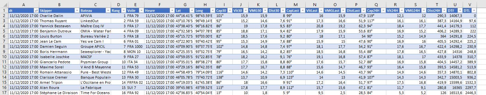
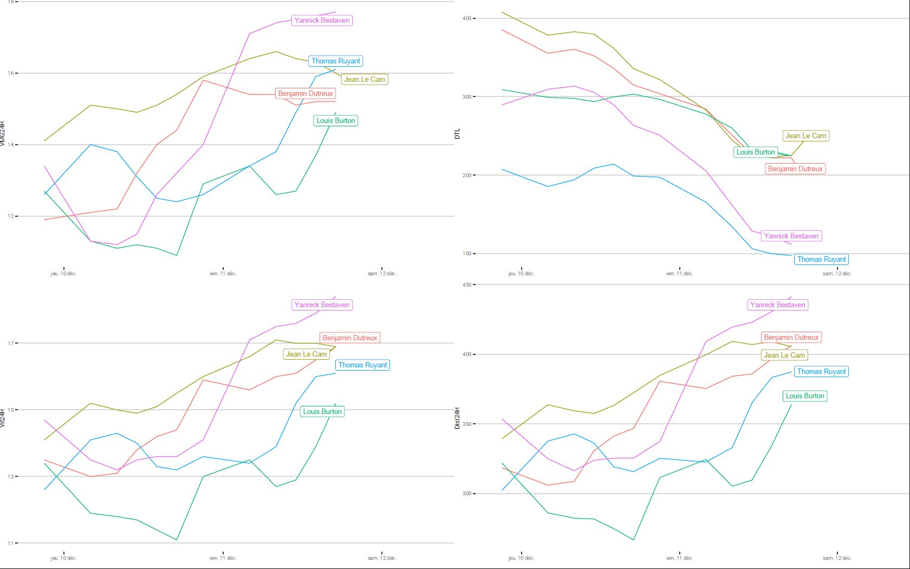

# vendeeglobe

This R Project collect the excel files on vendeegobe.org (https://www.vendeeglobe.org/fr/classement)
and create a plot and a consolidated dataset in CSV file.

Based on data.table and ggplot2

